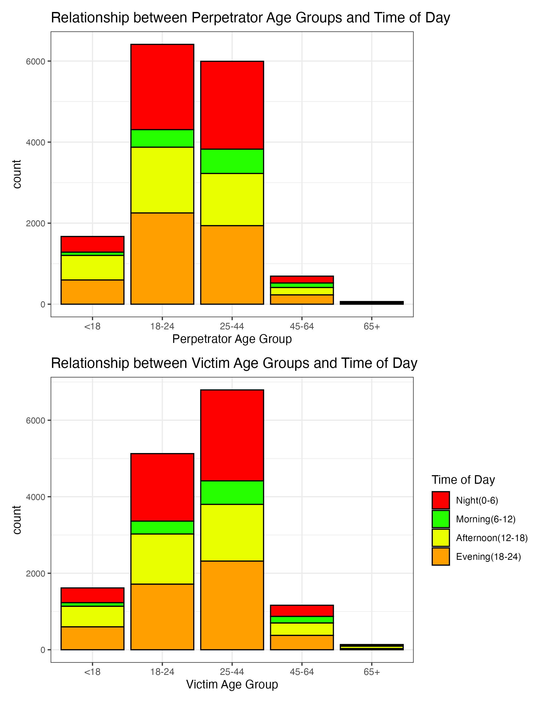
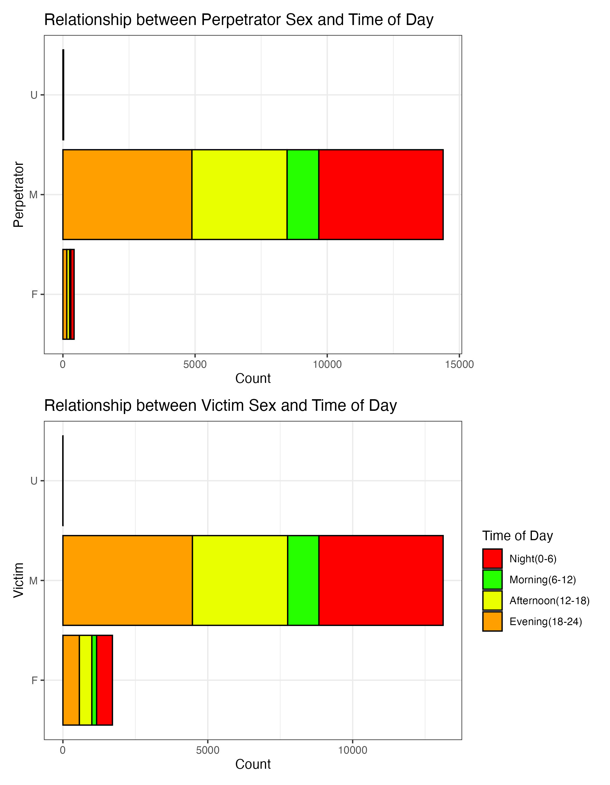
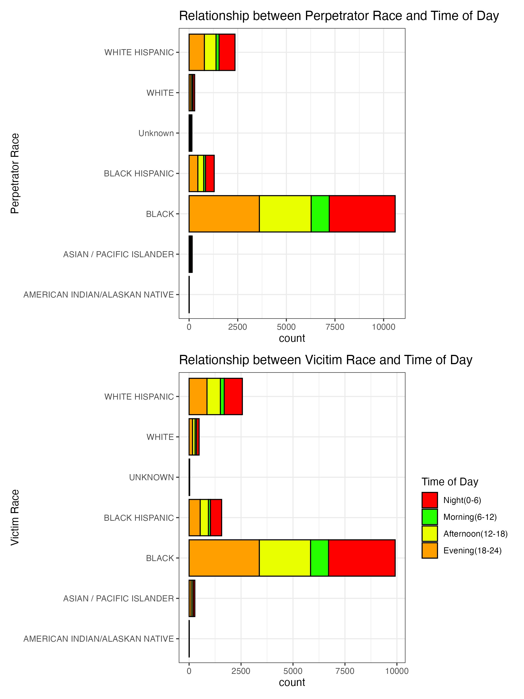

```{r libraries, echo=TRUE}
# Load the necessary libraries
library(tidyverse)
library(lubridate)
library(ggplot2)
library(dplyr)
library(scales)
library(readr)
library(patchwork)
```

```{r echo=TRUE}
# Load the dataset
df <- read.csv("NYPD_Shooting_Incident_Data__Historic_.csv", stringsAsFactors = FALSE)

# View the structure of the dataset
str(df)
```


```{r echo=FALSE}

# Convert date and time columns
df$OCCUR_DATE <- as.Date(df$OCCUR_DATE, format="%m/%d/%Y")
df$OCCUR_TIME <- hms::as_hms(df$OCCUR_TIME)

# Handle missing values
df <- df %>% mutate(
  PERP_AGE_GROUP = replace_na(PERP_AGE_GROUP, "UNKNOWN"),
  PERP_SEX = replace_na(PERP_SEX, "UNKNOWN"),
  PERP_RACE = replace_na(PERP_RACE, "UNKNOWN"),
  LOCATION_DESC = replace_na(LOCATION_DESC, "UNKNOWN")
)

# Convert STATISTICAL_MURDER_FLAG to a factor
df$STATISTICAL_MURDER_FLAG <- as.factor(df$STATISTICAL_MURDER_FLAG)

# Extract year and month for analysis
df$Year <- year(df$OCCUR_DATE)
df$Month <- month(df$OCCUR_DATE, label = TRUE)

# Visualization: Incidents over time
ggplot(df, aes(x = Year)) +
  geom_bar(fill = "steelblue", color = "black") +
  labs(title = "Number of Shooting Incidents Per Year", x = "Year", y = "Count") +
  theme_minimal()


# Analysis of yearly incidents
yearly_counts <- df %>% group_by(Year) %>% summarise(count = n())
summary(yearly_counts$count)


#### The data shows an overall trend of shootings over the years, with fluctuations depending on external factors such as law enforcement policies and socio-economic conditions. The highest number of incidents occurred in certain peak years, while a decline is observed in others.
####
```


```{r echo=FALSE}
# Visualization: Incidents by borough
ggplot(df, aes(x = BORO)) +
  geom_bar(fill = "darkred", color = "black") +
  labs(title = "Shooting Incidents by Borough", x = "Borough", y = "Count") +
  theme_minimal()


# Analysis of borough distribution
borough_counts <- df %>% group_by(BORO) %>% summarise(count = n())
  print(borough_counts)

#### Brooklyn and the Bronx report the highest number of shooting incidents, suggesting a potential focus area for law enforcement and community interventions.
####


```

```{r echo=FALSE}

# 
# df <- df %>%
#   mutate(PERP_AGE_GROUP = case_when(
#     PERP_AGE_GROUP == "<18" ~ 10,
#     PERP_AGE_GROUP == "18-24" ~ 21,
#     PERP_AGE_GROUP == "25-44" ~ 34.5,
#     PERP_AGE_GROUP == "45-64" ~ 54.5,
#     PERP_AGE_GROUP == "65+" ~ 70,
#     TRUE ~ NA_real_
#   ))
# df <- df %>%
#   mutate(VIC_AGE_GROUP = case_when(
#     VIC_AGE_GROUP == "<18" ~ 10,
#     VIC_AGE_GROUP == "18-24" ~ 21,
#     VIC_AGE_GROUP == "25-44" ~ 34.5,
#     VIC_AGE_GROUP == "45-64" ~ 54.5,
#     VIC_AGE_GROUP == "65+" ~ 70,
#     TRUE ~ NA_real_
#   ))


# ggplot(df, aes(x = OCCUR_TIME, fill = interaction(PERP_AGE_GROUP,VIC_AGE_GROUP)))+
#   geom_histogram(bins = 24)+
#   facet_wrap(~interaction(PERP_AGE_GROUP,VIC_AGE_GROUP), scales = "free_y")+
#   labs(title = "Distribution of Occurrence Times for Perpetrator and Victim Age Group Combinations",
#        x = "Occurrence Time",
#        y = "Count",
#        fill = "Age Group Combination") +
#   theme_bw()

# Data cleaning (handle missing values and convert OCCUR_TIME)
df$PERP_AGE_GROUP[df$PERP_AGE_GROUP == "(null)"] <- NA
df$VIC_AGE_GROUP[df$VIC_AGE_GROUP == "(null)"] <- NA
df <- na.omit(df) # Or impute missing values using appropriate method
df$OCCUR_TIME <- hms(df$OCCUR_TIME)
df$hour <- hour(df$OCCUR_TIME)

df$time_of_day <- cut(df$hour, breaks = c(0, 6, 12, 18, 24), labels = c("Night(0-6)", "Morning(6-12)", "Afternoon(12-18)", "Evening(18-24)"), include.lowest = TRUE)
df <- df[!(df$VIC_AGE_GROUP %in% c("UNKNOWN", "1022")), ]
df <- df[!(df$PERP_AGE_GROUP %in% c("UNKNOWN", "1020", "224", "940", "")), ]

# Create the heatmap
plot1 <- ggplot(df, aes(x = PERP_AGE_GROUP, fill = time_of_day)) +
  
  geom_bar(color = "black") +
  scale_fill_manual(values = c("Night(0-6)" = "red", "Evening(18-24)" = "#ffa000", "Afternoon(12-18)" = "#e9ff00", "Morning(6-12)" = "#25ff00"  )) +
  labs(title = "Relationship between Perpetrator Age Groups and Time of Day",
       x = "Perpetrator Age Group",
       stat = "count",
       fill = "Time of Day") +
  theme_bw()+
  theme(legend.position = "none", axis.text.y = element_text(size = 8))
plot2 <- ggplot(df, aes(x = VIC_AGE_GROUP, fill = time_of_day)) +
  
  geom_bar(color = "black") +
  scale_fill_manual(values = c("Night(0-6)" = "red", "Evening(18-24)" = "#ffa000", "Afternoon(12-18)" = "#e9ff00", "Morning(6-12)" = "#25ff00"  )) +
  labs(title = "Relationship between Victim Age Groups and Time of Day",
       x = "Victim Age Group",
       stat = "count",
       fill = "Time of Day") +
  theme_bw()+
  theme( axis.text.y = element_text(size = 8))
  combined_plot <- plot1 + plot2 + plot_layout(ncol = 1)
  
  ggsave("combined_plot1.png", combined_plot, width = 7, height = 9, units = "in")
  
```


```{r echo=FALSE}


#Data Cleaning
df$PERP_SEX[df$PERP_SEX %in% c("null", "U", "")] <- "U"
df$VIC_SEX[df$VIC_SEX %in% c("null", "U", "")] <- "U"
df <- df[df$PERP_SEX %in% c("F", "M", "U"), ]
df <- df[df$VIC_SEX %in% c("F", "M", "U"), ]
df <- na.omit(df) #remove rows with NA values

df$time_of_day <- cut(df$hour, breaks = c(0, 6, 12, 18, 24), labels = c("Night(0-6)", "Morning(6-12)", "Afternoon(12-18)", "Evening(18-24)"), include.lowest = TRUE)

plot3 <- ggplot(df, aes(x = PERP_SEX, fill = time_of_day)) +
  coord_flip()+
  geom_bar(color = "black") +
  scale_fill_manual(values = c("Night(0-6)" = "red", "Evening(18-24)" = "#ffa000", "Afternoon(12-18)" = "#e9ff00", "Morning(6-12)" = "#25ff00"  )) +
  labs(title = "Relationship between Perpetrator Sex and Time of Day",
       x = "Perpetrator",
       y = "Count",
       fill = "Time of Day") +
  theme_bw()+
  theme(legend.position = "none")

plot4 <- ggplot(df, aes(x = VIC_SEX, fill = time_of_day)) +
  coord_flip()+
  geom_bar(color = "black") +
  scale_fill_manual(values = c("Night(0-6)" = "red", "Evening(18-24)" = "#ffa000", "Afternoon(12-18)" = "#e9ff00", "Morning(6-12)" = "#25ff00"  )) +
  labs(title = "Relationship between Victim Sex and Time of Day",
       x = "Victim",
       y = "Count",
       fill = "Time of Day") +
  theme_bw()
  combined_plot <- plot3 + plot4 + plot_layout(ncol = 1)
  
  ggsave("combined_plot2.png", combined_plot, width = 7, height = 9, units = "in")
  

```

```{r include=FALSE}

#Clean PERP_RACE
df$PERP_RACE <- ifelse(df$PERP_RACE %in% c("(null)", "UNKNOWN", ""), "Unknown", df$PERP_RACE)

# View the updated data frame

ggplot(df, aes(x = BORO, fill = PERP_RACE)) +
  coord_flip()+
  geom_bar(position = "fill", color = "black") +
  labs(title = "Distribution of Perpetrator Race by Borough", 
       x = "Borough", y = "Proportion", fill = "Perpetrator Race") +
  scale_y_continuous(labels = percent) +
  scale_fill_manual(values = c("AMERICAN INDIAN/ALASKAN NATIVE" = "red", "ASIAN / PACIFIC ISLANDER" = "yellow", "BLACK" = "#292424", "BLACK HISPANIC" = "#797974", "WHITE HISPANIC" = "#f8fcc2", "WHITE" = "white", "Unknown" = "#d2d2cd")) +
  theme_bw()
```


```{r echo=FALSE}
plot5 <- ggplot(df, aes(x = PERP_RACE, fill = time_of_day)) +
  coord_flip()+
  geom_bar(color = "black") +
  scale_fill_manual(values = c("Night(0-6)" = "red", "Evening(18-24)" = "#ffa000", "Afternoon(12-18)" = "#e9ff00", "Morning(6-12)" = "#25ff00"  )) +
  labs(title = "Relationship between Perpetrator Race and Time of Day",
       x = "Perpetrator Race",
       stat = "count",
       fill = "Time of Day") +
  theme_bw()+
  theme(legend.position = "none")

plot6 <- ggplot(df, aes(x = VIC_RACE, fill = time_of_day)) +
  coord_flip()+
  geom_bar(color = "black") +
  scale_fill_manual(values = c("Night(0-6)" = "red", "Evening(18-24)" = "#ffa000", "Afternoon(12-18)" = "#e9ff00", "Morning(6-12)" = "#25ff00"  )) +
  labs(title = "Relationship between Vicitim Race and Time of Day",
       x = "Victim Race",
       stat = "count",
       fill = "Time of Day") +
  theme_bw()+
  theme(title = element_text(1))
  combined_plot <- plot5 + plot6 + plot_layout(ncol = 1)
  
  ggsave("combined_plot3.png", combined_plot, width = 7.5, height = 10, units = "in")
  
```

